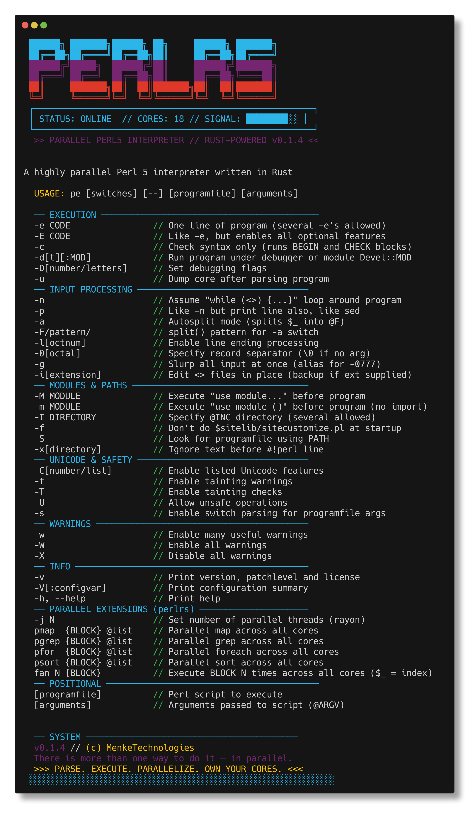

```
 ██████╗ ███████╗██████╗ ██╗     ██████╗ ███████╗
 ██╔══██╗██╔════╝██╔══██╗██║     ██╔══██╗██╔════╝
 ██████╔╝█████╗  ██████╔╝██║     ██████╔╝███████╗
 ██╔═══╝ ██╔══╝  ██╔══██╗██║     ██╔══██╗╚════██║
 ██║     ███████╗██║  ██║███████╗██║  ██║███████║
 ╚═╝     ╚══════╝╚═╝  ╚═╝╚══════╝╚═╝  ╚═╝╚══════╝
```

[](https://github.com/MenkeTechnologies/perlrs/actions/workflows/ci.yml)
[](https://crates.io/crates/perlrs)
[](https://crates.io/crates/perlrs)
[](https://docs.rs/perlrs)
[](https://opensource.org/licenses/MIT)

### `[PARALLEL PERL5 INTERPRETER // RUST-POWERED EXECUTION ENGINE]`

 ┌──────────────────────────────────────────────────────────────┐
 │ STATUS: ONLINE &nbsp;&nbsp; CORES: ALL &nbsp;&nbsp; SIGNAL: ████████░░       │
 └──────────────────────────────────────────────────────────────┘

> *"There is more than one way to do it — in parallel."*

---

## [0x00] OVERVIEW

`perlrs` is a Perl 5 compatible interpreter written in Rust that brings native parallelism to Perl scripting. It parses and executes Perl 5 scripts with rayon-powered work-stealing parallel primitives across all available CPU cores.

 ┌──────────────────────────────────────────────────────────────┐
 │ RAYON THREADS: ALL CORES &nbsp;&nbsp; REGEX: SIMD-ACCELERATED         │
 │ BINARY SIZE: 2MB STRIPPED &nbsp;&nbsp; BUILD: LTO + O3               │
 └──────────────────────────────────────────────────────────────┘

---

## [0x01] SYSTEM REQUIREMENTS

- Rust toolchain // `rustc` + `cargo`

## [0x02] INSTALLATION

#### DOWNLOADING PAYLOAD FROM CRATES.IO

```sh
cargo install perlrs
```

#### COMPILING FROM SOURCE

```sh
git clone https://github.com/MenkeTechnologies/perlrs
cd perlrs
cargo build --release
```

[perlrs on Crates.io](https://crates.io/crates/perlrs)

#### ZSH COMPLETION // TAB-COMPLETE ALL THE THINGS

```sh
# copy to a directory in your fpath
cp completions/_perlrs /usr/local/share/zsh/site-functions/_perlrs
cp completions/_pe /usr/local/share/zsh/site-functions/_pe

# or add the completions directory to fpath in your .zshrc
fpath=(/path/to/perlrs/completions $fpath)

# then reload completions
autoload -Uz compinit && compinit
```

After reloading your shell, `pe <TAB>` will complete all flags, options, and script files.

---

## [0x03] USAGE

#### EXECUTING INLINE CODE // DIRECT INJECTION

```sh
# inject a single line of perl
pe -e 'print "Hello, world!\n"'

# execute a script file
pe script.pl arg1 arg2

# check syntax without executing
pe -c script.pl
```

#### PROCESSING DATA STREAMS // STDIN OPERATIONS

```sh
# line-by-line processing
echo "data" | pe -ne 'print uc $_'

# auto-print mode (like sed)
cat file.txt | pe -pe 's/foo/bar/g'

# slurp entire input at once
cat file.txt | pe -gne 'print length($_), "\n"'

# auto-split fields
echo "a:b:c" | pe -a -F: -ne 'print $F[1], "\n"'
```

#### PARALLEL EXECUTION // MULTI-CORE OPERATIONS

```perl
# parallel map — transform elements across all cores
my @doubled = pmap { $_ * 2 } @data;

# parallel map in batches (one interpreter per chunk — amortizes spawn cost)
my @out = pmap_chunked 1000 { $_ ** 2 } @million_items;

# lazy pipeline (ops run on collect(); chain with anonymous subs)
my @result = pipeline(@data)
    ->filter(sub { $_ > 10 })
    ->map(sub { $_ * 2 })
    ->take(100)
    ->collect();

# parallel grep — filter elements in parallel
my @evens = pgrep { $_ % 2 == 0 } @data;

# parallel foreach — execute side effects concurrently
pfor { process($_) } @items;

# fan — run a block N times in parallel (`$_` is 0..N-1)
fan 8 { work($_) }

# typed channels — pass messages between parallel blocks
my ($tx, $rx) = pchannel();
fan 10 { $tx->send($_) };
while (my $msg = $rx->recv()) { print "$msg\n" }

# deque — double-ended queue (not in stock Perl)
my $q = deque();
$q->push_back(1); $q->push_front(0);
# pop_front / pop_back / size (or len)

# heap — priority queue with a Perl comparator (`$a` / `$b`, like `sort`)
my $pq = heap(sub { $a <=> $b });
$pq->push(3); my $min = $pq->pop();

# parallel sort — sort using all cores
my @sorted = psort { $a <=> $b } @data;

# chain parallel operations
my @result = pmap { $_ ** 2 } pgrep { $_ > 100 } @data;

# parallel recursive glob (rayon directory walk), then process files in parallel
my @logs = glob_par("**/*.log");
pfor { process($_) } @logs;

# persistent thread pool (reuse worker OS threads; avoids per-task thread spawn from pmap/pfor)
my $pool = ppool(4);
$pool->submit(sub { heavy_work($_) }, $_) for @tasks;   # optional 2nd arg binds $_
my @results = $pool->collect();

# control thread count
pe -j 8 -e 'my @r = pmap { heavy_work($_) } @data'
```

Each parallel block receives its own interpreter context with captured lexical scope // no data races. Use `mysync` to share state.

#### EXECUTION TRACE // `trace`

Wrap parallel (or any) code to print **`mysync` scalar** mutations to **stderr** — useful when debugging races or ordering. Under `fan N { }`, lines are tagged with the worker index (same as `$_`).

```perl
mysync $counter = 0;
trace { fan 10 { $counter++ } };
# stderr: [thread 0] $counter: 0 → 1
# stderr: [thread 3] $counter: 1 → 2
# ... (order varies)
```

Outside `fan`, mutations are labeled `[main]`.

#### TIMER // `timer`

Wall-clock benchmark: **`timer { BLOCK }`** returns elapsed time as a **float** in **milliseconds** (sub-ms resolution).

```perl
my $elapsed = timer { heavy_work() };
print "took ${elapsed}ms\n";
```

#### ASYNC / AWAIT // lightweight I/O parallelism

**`async { BLOCK }`** runs the block on a **worker thread** and returns a task handle immediately. **`await EXPR`** joins: if `EXPR` is that handle, it blocks until the block finishes and returns its value; otherwise `await` passes the value through.

Use this to overlap **`fetch_url`**, **`slurp`**, or other I/O-bound work without blocking the main interpreter until you **`await`**.

```perl
my $data = async { fetch_url("https://example.com/") };
my $file = async { slurp("big.csv") };
print await($data), await($file);
```

Each `async` worker gets a **clone of the interpreter’s subs** and a **captured lexical scope** (including **`mysync`** storage), so closures and shared state behave like other parallel primitives.

#### THREAD-SAFE SHARED STATE // `mysync`

`mysync` declares variables backed by `Arc<Mutex>` that are shared across parallel blocks. All reads/writes go through the lock automatically. Compound operations (`++`, `+=`, `.=`, and `|=`, `&=` on scalars holding a native `Set`) are fully atomic — the lock is held for the entire read-modify-write cycle.

For **`mysync` scalars that hold a `Set`** (from `mysync $s = Set->new(...)`), union (`|`) and intersection (`&`) treat the stored value as a set even when the underlying storage is the mutex-wrapped scalar; bitwise `|` / `&` on plain integers is unchanged.

**`deque()` and `heap(...)`**: `mysync $q = deque()` (and `mysync $pq = heap(sub { $a <=> $b })`) stores the value without an extra `Atomic` shell — they already use `Arc<Mutex<…>>`. Use them like any other `mysync` scalar in `fan` / `pmap` / `pfor` so all workers share one queue or heap.

```perl
# shared scalar — atomic increment
mysync $counter = 0;
fan 10000 { $counter++ };
print $counter;  # always exactly 10000

# shared array — thread-safe push/pop/shift
mysync @results;
pfor { push @results, $_ * $_ } (1..100);
print scalar @results;  # always exactly 100

# shared hash — atomic element access
mysync %histogram;
pfor { $histogram{$_ % 10} += 1 } (0..999);
# each bucket is exactly 100

# mix all three
mysync $total = 0;
mysync @items;
mysync %stats;
fan 1000 {
    $total++;
    push @items, $_;
    $stats{$_ % 5} += 1;
};
# $total == 1000, @items == 1000, sum(%stats) == 1000
```

Without `mysync`, each parallel thread gets an independent copy — changes are not visible to other threads or the parent. With `mysync`, all threads share the same underlying storage via `Arc<Mutex>`.

 ┌──────────────────────────────────────────────────────────────┐
 │ ATOMIC OPS: $x++ &nbsp;&nbsp; ++$x &nbsp;&nbsp; $x += N &nbsp;&nbsp; $x .= "s" &nbsp;&nbsp; $s |= $t (Set) │
 │ ATOMIC OPS: $h{k} += N &nbsp;&nbsp; $a[i] += N &nbsp;&nbsp; push @a, $v      │
 │ LOCK SCOPE: held for full read-modify-write // zero races   │
 └──────────────────────────────────────────────────────────────┘

---

## [0x04] CLI FLAGS



---

## [0x05] SUPPORTED PERL FEATURES

#### DATA TYPES
- Scalars (`$x`), arrays (`@a`), hashes (`%h`)
- References: `\$x`, `\@a`, `\%h`, `\&sub`
- Array refs `[1,2,3]`, hash refs `{a => 1}`
- Code refs / closures `sub { ... }`
- Regex objects `qr/.../`
- Blessed references (basic OOP)

#### CONTROL FLOW
- `if`/`elsif`/`else`, `unless`
- `while`, `until`, `do { } while/until` (block runs before the first condition check)
- `for` (C-style), `foreach`
- `last`, `next`, `redo` with labels
- Postfix: `expr if COND`, `expr unless COND`, `expr while COND`, `expr for @list`
- Ternary `?:`

#### OPERATORS
- Arithmetic: `+`, `-`, `*`, `/`, `%`, `**`
- String: `.` (concat), `x` (repeat)
- Comparison: `==`, `!=`, `<`, `>`, `<=`, `>=`, `<=>`
- String comparison: `eq`, `ne`, `lt`, `gt`, `le`, `ge`, `cmp`
- Logical: `&&`, `||`, `//`, `!`, `and`, `or`, `not`
- Bitwise: `&`, `|`, `^`, `~`, `<<`, `>>` (for native `Set` values, `|` / `&` are union / intersection instead of integer bitwise ops)
- Assignment: `=`, `+=`, `-=`, `*=`, `/=`, `.=`, `|=`, `&=`, `//=`, etc.
- Regex: `=~`, `!~`
- Range: `..`
- Arrow dereference: `->`

#### REGEX ENGINE
- Match: `$str =~ /pattern/flags`
- Substitution: `$str =~ s/pattern/replacement/flags`
- Transliterate: `$str =~ tr/from/to/`
- Flags: `g`, `i`, `m`, `s`, `x`
- Capture variables: `$1`, `$2`, etc.
- Quote-like: `m//`, `qr//`

#### SUBROUTINES
- Named subs with `sub name { ... }`
- Anonymous subs / closures
- Recursive calls
- `@_` argument passing, `shift`, `return`
- `return EXPR if COND` (postfix modifiers on return)

#### BUILT-IN FUNCTIONS

 ┌──────────────────────────────────────────────────────────────┐
 │ **Array**: push, pop, shift, unshift, splice, reverse,      │
 │ sort, map, grep, scalar                                     │
 │ **Hash**: keys, values, each, delete, exists                │
 │ **String**: chomp, chop, length, substr, index, rindex,     │
 │ split, join, sprintf, printf, uc, lc, ucfirst, lcfirst,     │
 │ chr, ord, hex, oct, crypt, fc, pos, study                     │
 │ **Numeric**: abs, int, sqrt, sin, cos, atan2, exp, log,     │
 │ rand, srand                                                 │
 │ **I/O**: print, say, printf, open, close, eof, readline,    │
 │ slurp, capture (structured shell: ->stdout/stderr/exit),   │
 │ binmode, fileno, flock, getc, sysread, syswrite, sysseek,  │
 │ select (timeout sleep / handle no-op), truncate             │
 │ **Directory**: opendir, readdir, closedir, rewinddir,        │
 │ telldir, seekdir                                              │
 │ **File tests**: -e, -f, -d, -l, -r, -w, -s, -z             │
 │ **System**: system, exec, exit, chdir, mkdir, unlink, stat, │
 │ lstat, link, symlink, readlink, glob, glob_par, ppool,      │
 │ fork, wait, waitpid, kill, alarm, sleep, times (Unix where  │
 │ noted in source)                                            │
 │ **Socket** (std::net): socket, bind, listen, accept,         │
 │ connect, send, recv, shutdown                               │
 │ **Type**: defined, undef, ref, bless                        │
 │ **Set**: `Set->new(…)` — native set; `|` union, `&` intersection │
 │ **Control**: die, warn, eval, do, require, caller,         │
 │ wantarray (scalar default 0; VM uses `wantarray_ctx`),      │
 │ `goto EXPR` (same-block labels), `continue { }` on loops, │
 │ `prototype` on code refs; sub prototypes parsed on `sub`     │
 └──────────────────────────────────────────────────────────────┘

#### OTHER FEATURES
- `Interpreter::execute` returns `Err(ErrorKind::Exit(code))` for `exit` (including code 0); the `perlrs` binary maps that to `process::exit`.
- `use strict`, `use warnings` (recognized)
- `package` declarations
- `BEGIN`/`END` blocks
- String interpolation with `$var`, `$hash{key}`, `$array[idx]`
- Heredocs (`<<EOF`)
- `qw()`, `q()`, `qq()`
- POD documentation skipping
- Shebang line handling

---

## [0x06] ARCHITECTURE

```
 ┌─────────────────────────────────────────────────────┐
 │  Source Code                                        │
 │      │                                              │
 │      ▼                                              │
 │  Lexer (src/lexer.rs)                               │
 │      │ Tokens                                       │
 │      ▼                                              │
 │  Parser (src/parser.rs)                             │
 │      │ AST                                          │
 │      ▼                                              │
 │  Interpreter (src/interpreter.rs)                   │
 │      ├── Sequential: map, grep, sort, foreach       │
 │      └── Parallel:   pmap, pgrep, psort, pfor, fan │
 │              │                                      │
 │              ▼                                      │
 │          RAYON WORK-STEALING SCHEDULER              │
 │          ▓▓▓▓▓▓▓▓▓▓▓▓▓▓▓▓▓▓▓▓▓▓▓▓▓▓               │
 │          CORE 0 │ CORE 1 │ ... │ CORE N             │
 └─────────────────────────────────────────────────────┘
```

- **Lexer** // Context-sensitive tokenizer handling Perl's ambiguous syntax (regex vs division, hash vs modulo, heredocs, interpolated strings)
- **Parser** // Recursive descent with Pratt precedence climbing for expressions
- **Interpreter** // Tree-walking execution with proper lexical scoping, `Arc<RwLock>` for thread-safe reference types
- **Parallelism** // Each parallel block gets an isolated interpreter with captured scope; rayon handles work-stealing scheduling

---

## [0x07] EXAMPLES

```sh
pe examples/fibonacci.pl
pe examples/text_processing.pl
pe examples/parallel_demo.pl
```

---

## [0x08] BENCHMARKS

 ┌──────────────────────────────────────────────────────────────┐
 │ BENCHMARK SUITE // perlrs vs perl 5.42.2 // Apple M5 18-core │
 └──────────────────────────────────────────────────────────────┘

```
  TEST                    perl5(ms) perlrs(ms)      RATIO
  ──────────────────── ───────── ────────── ─────
  startup                     6.8ms      6.4ms      0.94x  ✓ faster
  fib(25)                    23.6ms     48.4ms      2.05x
  loop 10k                    7.1ms      7.6ms      1.07x  ≈ parity
  string concat 10k           7.0ms     11.2ms      1.60x
  hash 1k                     7.3ms     18.5ms      2.53x
  array sort 10k              7.8ms    236.9ms     30.37x
  regex match 1k              7.2ms     35.4ms      4.92x
  map+grep 10k                7.6ms      7.7ms      1.01x  ≈ parity
```

> Measured on macOS with `perl v5.42.2` vs `perlrs` release build (LTO + O3).
> Times include process startup (~7ms). Run with `bash bench/run_bench.sh`.

#### Analysis

- **startup** and **map+grep** are at parity or faster — the Rust binary cold-starts faster than perl and the bytecode VM dispatches map/grep at native speed
- **loop** is within 7% — the VM's flat dispatch loop with integer fast paths nearly matches perl's decades-old bytecode engine
- **fib** is 2x slower — recursive function calls still pay scope-frame overhead; a register-based VM would close this gap
- **string** is 1.6x — each `$s = $s . "x"` clones the growing string; an in-place append optimization would fix this
- **hash** is 2.5x — hash iteration via `keys %h` + `$h{$k}` involves more indirection than perl's internal HV
- **regex** is 4.9x — the regex itself is cached and fast (Rust `regex` crate with SIMD), but the 1000-iteration for-loop + if-block overhead dominates
- **array sort** is 30x — the sort comparator calls the tree-walker per comparison; compiling sort blocks to bytecode would fix this

#### Parallel speedup

```
  fan 18 { system("sleep 0.1") }   →  0.12s total  (vs 1.8s sequential)
```

True parallelism across all cores via rayon work-stealing. The `fan`, `pmap`, `pgrep`, `pfor`, and `psort` commands distribute work automatically.

---

## [0x09] DEVELOPMENT & CI

Pull requests and pushes to `main` run the workflow in [`.github/workflows/ci.yml`](.github/workflows/ci.yml). You can also run it manually from the repository **Actions** tab (**workflow dispatch**). On a pull request, the **Checks** tab (or the merge box) shows the aggregate status; open the **CI** workflow run for per-job logs (Check, Test, Format, Clippy, Doc, Release Build).

Library unit tests (parser smoke batches `parse_smoke_*`, **`parser_shape_tests`**, lexer/token/value/error/scope/`ast`, **`interpreter_unit_tests`**, **`crate_api_tests`**, **`run_semantics_tests`** / **`run_semantics_more`** (`run` coverage), **`bytecode::Chunk`** pool/intern/jump patching, **`compiler`** compile-to-op smoke checks, **`vm`** hand-built bytecode execution, `parse` / `try_vm_execute`); excludes `tests/` integration suite):

```sh
cargo test --lib
```

Integration tests live in `tests/integration.rs` and `tests/suite/` (grouped modules such as `runtime_extra` and `runtime_more` for assignment, builtins, aggregates, control flow, and regex/subs):

```sh
cargo test --test integration
```

Extended parse-only smoke coverage is in `src/parse_smoke_extended.rs` and `src/parse_smoke_batch2.rs` (built only with `cfg(test)`).

CI uses `cargo … --locked`; **`Cargo.lock` is committed** so dependency resolution matches CI and release builds. If you use a global gitignore that ignores `Cargo.lock`, force-add updates when dependencies change: `git add -f Cargo.lock`.

---

## [0xFF] LICENSE

 ┌──────────────────────────────────────────────────────┐
 │ MIT LICENSE // UNAUTHORIZED REPRODUCTION WILL BE MET │
 │ WITH FULL ICE                                        │
 └──────────────────────────────────────────────────────┘

---

```
░░░░░░░░░░░░░░░░░░░░░░░░░░░░░░░░░░░░░░░░░░░░░░░░░░░░░░░░░░░
░░ >>> PARSE. EXECUTE. PARALLELIZE. OWN YOUR CORES. <<< ░░
░░░░░░░░░░░░░░░░░░░░░░░░░░░░░░░░░░░░░░░░░░░░░░░░░░░░░░░░░░░
```

##### created by [MenkeTechnologies](https://github.com/MenkeTechnologies)
